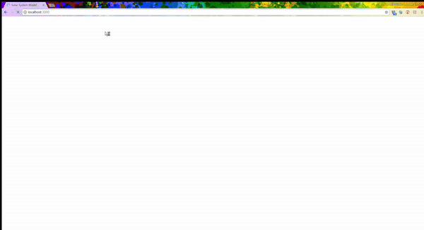

# solarsystemmodel
A Solar System Model built with [WhitestormJS Framework](https://github.com/WhitestormJS), which is based on [three.js](https://threejs.org/).

The control panel used [animate.css](https://daneden.github.io/animate.css/).

With the control panel, you can stop and resume the rotation and revolution of the planets. Also, you can adjust the camera from the view of planet.

